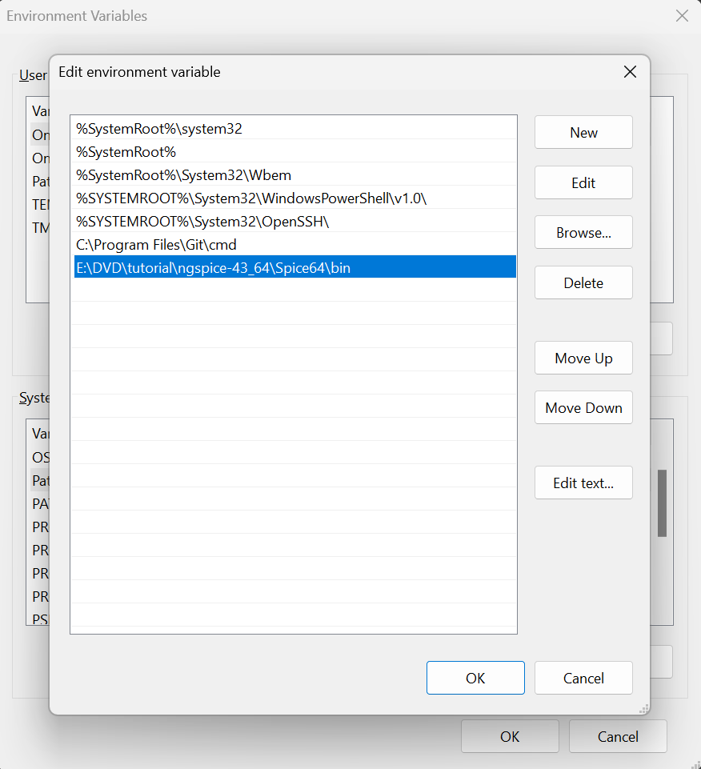

Generator.py:\
->Generates the single MOS data for NMOS,PMOS with varying Widths,Vd,Vs \
    Outputs stored at DVD_MOS_files\temp \
->Generates the Stacked MOS data for NMOS and PMOS with varying Va,Vb \
    Outputs stored at STACKED_MOS_files\temp 

Utils.py:\
Finds the single MOS data corresponding to the obtained Stacked MOS data(Intermediate node voltages) and estimates the leakage current \
    Output stored in Estimations.txt file

Setup:\
install pandas and openpyxl pip packages:\
pip install openpyxl \
pip install pandas 

Add your ngspice bin folder in environment Path variable:\
Open "Edit the system environment variables" --> "Environment variables" \
In "System Variables" double click on "Path" and add the ngspice bin folder Path in the list of Paths 

NMOS Stack Leakage Estimation:
//   (Va,Vb)
//Both OFF :: Id of M2(TOP)
case (0, 0):
    leakage_current=VI_data_2['idrain'].values[0]
//M1:OFF M2:ON :: Id of M1 + Ig of M2
case (0, 1.1):
    leakage_current=VI_data_1['idrain'].values[0]+VI_data_2['igate'].values[0]
//M1:ON M2:OFF :: Ig of M1 + Id of M2
case (1.1, 0):
    leakage_current=VI_data_1['igate'].values[0]+VI_data_2['idrain'].values[0]
//M1:ON M2:ON :: Ig of M1 + Ig of M2
case (1.1,1.1):
    leakage_current=VI_data_1['igate'].values[0]+VI_data_2['igate'].values[0]